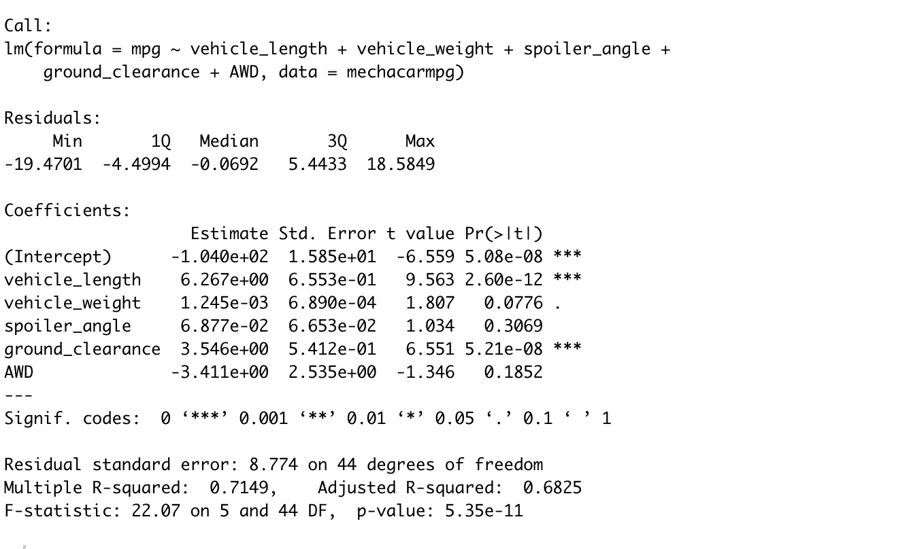

# MechaCar_Statistical_Analysis
Statistical Analysis with R 

## Linear Regression to Predict MPG
The output of our linear regression can be seen below:

* Our summary shows us that vehicle_length and ground_clearance provided a non-random amount of variance to the mpg values in the dataset.
* The summary also demonstrates that the slope of the linear model is not zero. The p-value of 5.35e-11 is much less than statistical significance threshold of 0.05%. 
* Overall, this linear model predicts the mpg of MechaCar prototypes effectively. This is proven by our R-squared value of 0.7149. 
