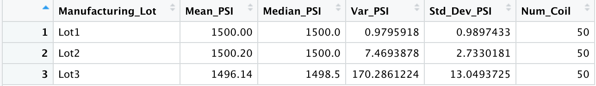
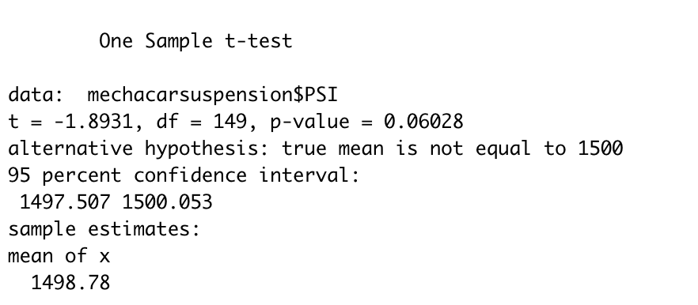
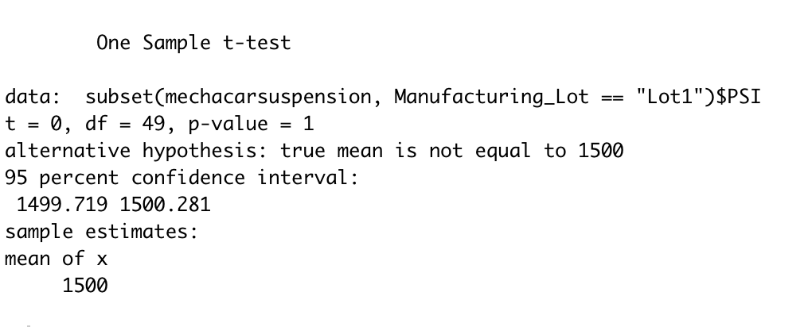
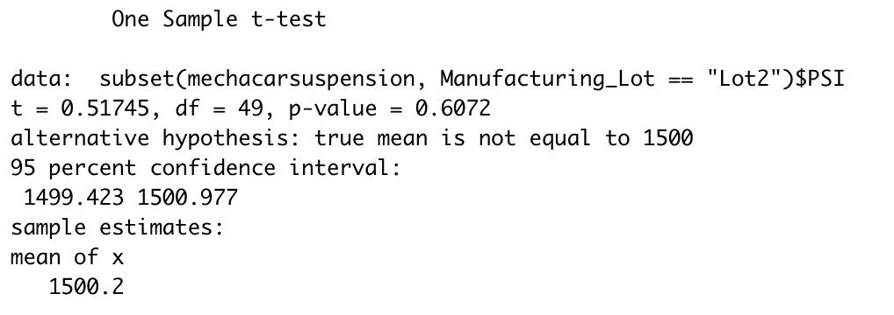
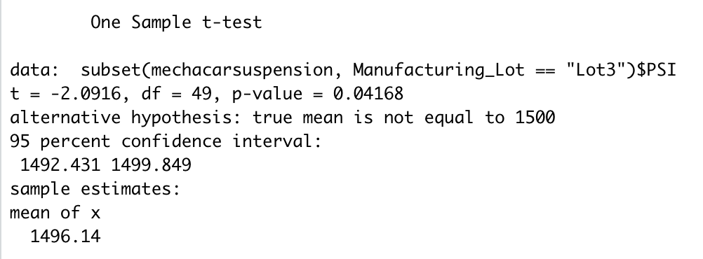

# MechaCar_Statistical_Analysis
Statistical Analysis with R 

## Linear Regression to Predict MPG
The output of our linear regression can be seen below:

* Our summary shows us that vehicle_length and ground_clearance provided a non-random amount of variance to the mpg values in the dataset.
* The summary also demonstrates that the slope of the linear model is not zero. The p-value of 5.35e-11 is much less than statistical significance threshold of 0.05%. 
* Overall, this linear model predicts the mpg of MechaCar prototypes effectively. This is proven by our R-squared value of 0.7149. 

## Summary Statistics on Suspension Coils
Our total_summary and lot_summary can be seen below:

* The design specifications for the MechaCar suspension coils dictate that the variance of the suspension coils must not exceed 100 pounds per square inch. The current manufacturing data meets this design specification for all manufacturing lots in total, as seen in the variance of 62.29 in the total_summary. However, Lot3, with a variance of 170.29, shows that the current manufacturing data does not meet this design specification in each lot individually. 

## T-Tests on Suspension Coils
The results of our t-tests that compares all manufacturing lots against mean PSI of the population and lots 1, 2 and 3, respectively, are below:

* The first image, showing a t-test of all manufacturing lots combined, displays a mean of 1498.78, with a p-value of 0.0628. This suggests that the combined lots are not significantly statistically different from the population mean of 1,500 pounds per square inch.
* None of the means and p-values of each lot individually suggests that the lot is significantly statistically different from the population mean of 1,500 pounds per squar inch. 

## Study Design: MechaCar vs Competition
A study to analyze the difference between MechaCar and its comptition would examine cost, fuel efficiency, horse power, maintenance cost, and safety rating. The null hypothesis would be that MechaCar is competatively price for its features vs its compeition. The alternative hypothesis would be that MechaCar is not competatively price for its features vs its competition. To test this hypothesis, we could run a linear regession to determine how fuel efficiency, horse power, maintenance cost, and safety rating effects price. To execute this study, we would need MechaCar and the competition's sales data for the past five years. 

